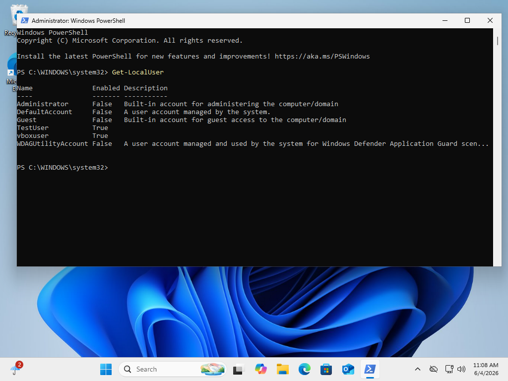
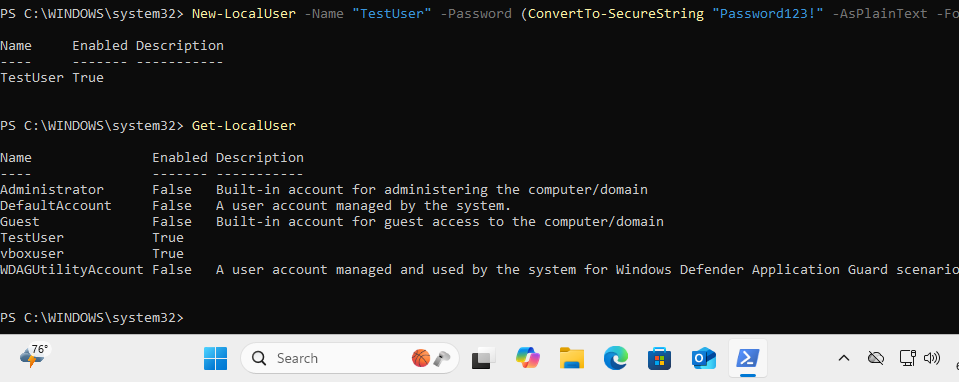
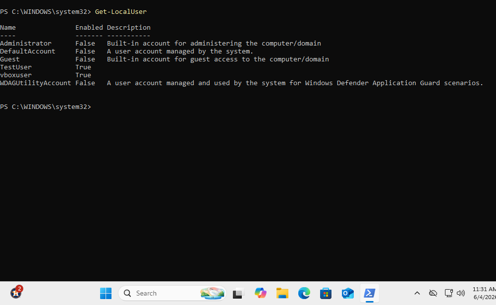
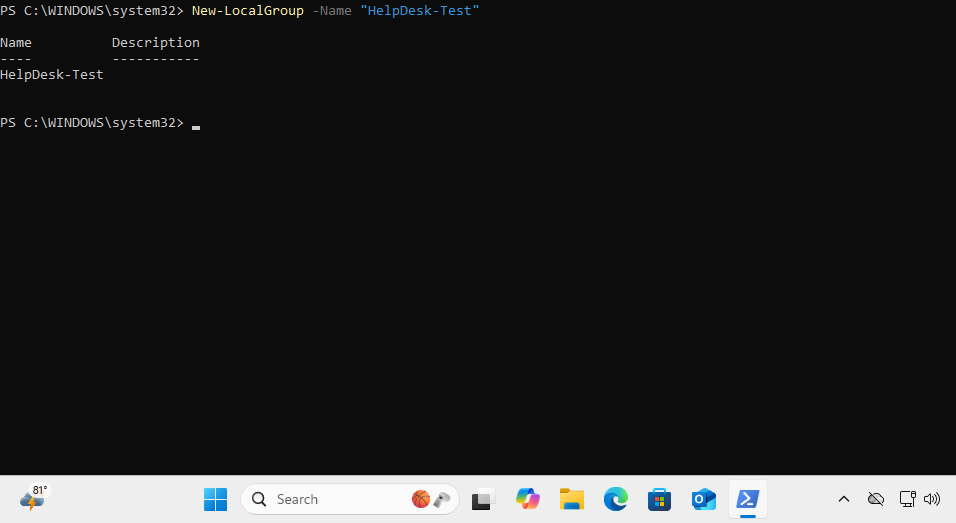
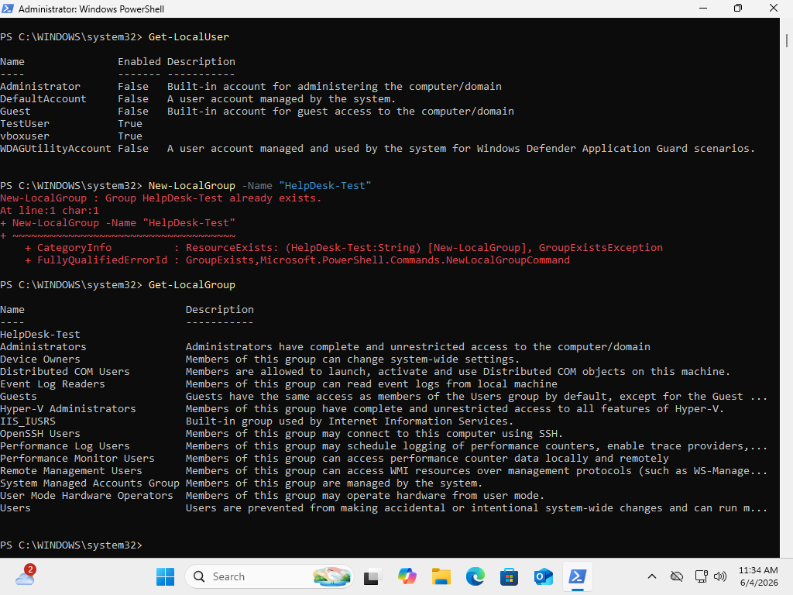
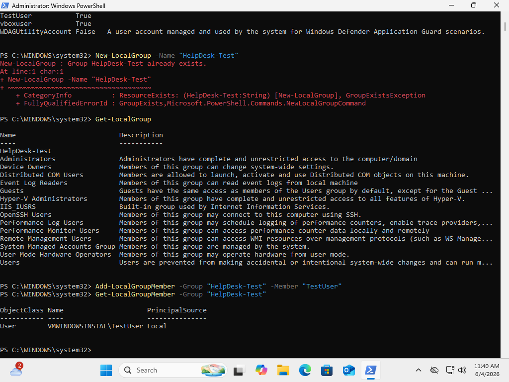
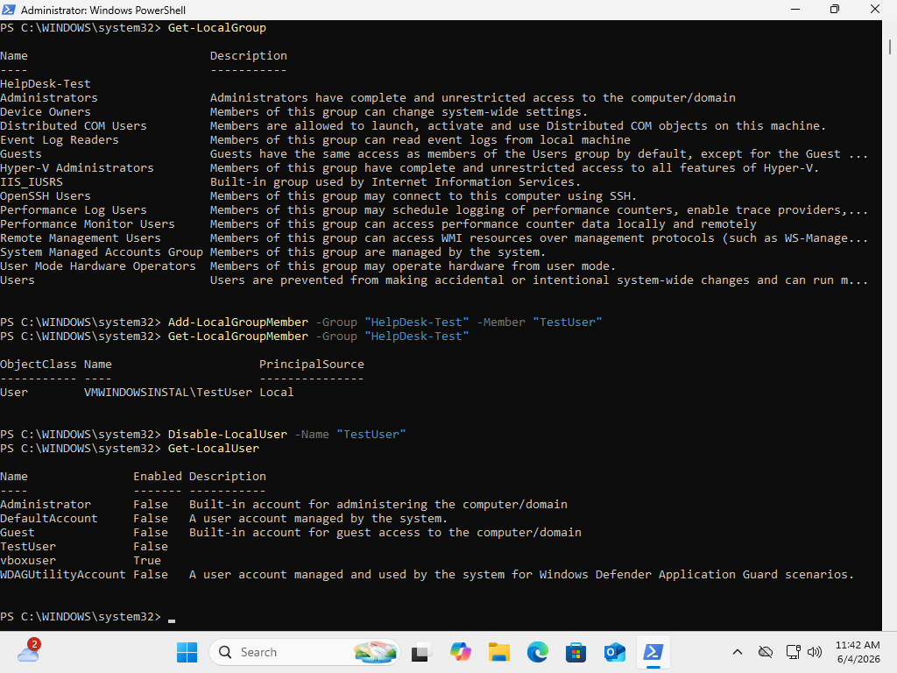
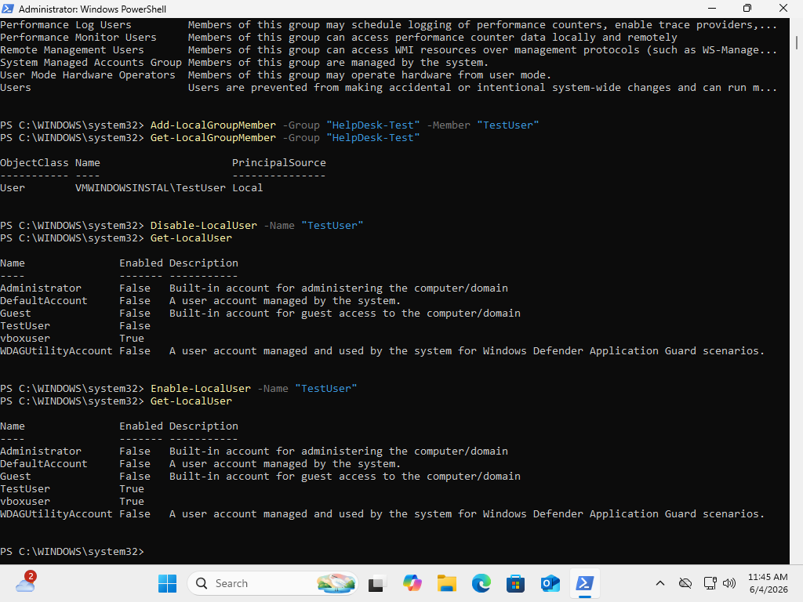
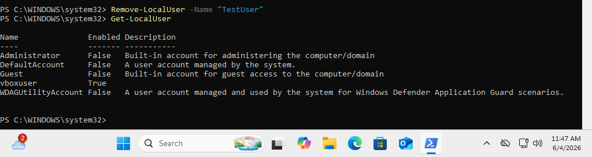
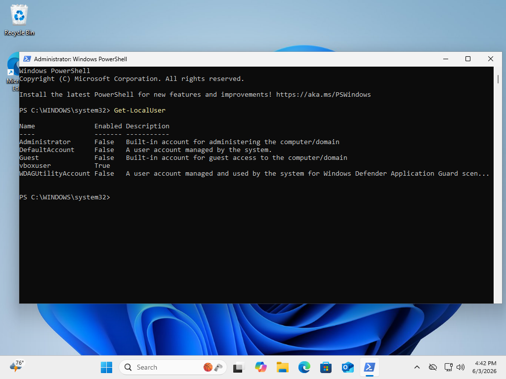

# Windows User Account Management with PowerShell Lab

## Project Overview

This lab demonstrates user and group administration in Windows 11 using PowerShell.

The objective was to gain hands-on experience with managing local user accounts and security groups through command-line administration. Tasks included creating users, verifying account creation, creating groups, assigning users to groups, disabling and enabling accounts, and removing accounts.

These are common administrative tasks performed by Help Desk Technicians, Desktop Support Specialists, and System Administrators.

---

## Technologies Used

* Windows 11 Home
* Windows PowerShell
* Local User Management Commands
* Local Group Management Commands
* Oracle VirtualBox

---

## Lab Objectives

* View existing local user accounts
* Create a new local user account
* Verify user account creation
* Create a custom security group
* Verify group creation
* Add a user to a local group
* Verify group membership
* Disable a user account
* Re-enable a user account
* Remove a user account
* Verify account deletion

---

## Environment Verification

### Existing Local Users

Used PowerShell to review all existing local user accounts on the system.

```powershell
Get-LocalUser
```



---

## User Creation

### Create Test User

Created a new local user account named **TestUser** using PowerShell.

```powershell
New-LocalUser -Name "TestUser" -Password (ConvertTo-SecureString "Password123!" -AsPlainText -Force)
```



---

## Verify User Creation

Confirmed that the newly created account appears in the local user database.

```powershell
Get-LocalUser
```



---

## Group Management

### Create Local Group

Created a custom local group named **HelpDesk-Test**.

```powershell
New-LocalGroup -Name "HelpDesk-Test"
```



---

### Verify Local Group

Verified the new group was successfully created.

```powershell
Get-LocalGroup
```



---

## Group Membership Administration

### Add User to Group

Added the TestUser account to the HelpDesk-Test group.

```powershell
Add-LocalGroupMember -Group "HelpDesk-Test" -Member "TestUser"
```

---

### Verify Group Membership

Verified the user was successfully added to the group.

```powershell
Get-LocalGroupMember -Group "HelpDesk-Test"
```



---

## Account Administration

### Disable User Account

Disabled the TestUser account.

```powershell
Disable-LocalUser -Name "TestUser"
```

Verified the account status changed from True to False.



---

### Enable User Account

Re-enabled the TestUser account.

```powershell
Enable-LocalUser -Name "TestUser"
```

Verified the account status changed back to True.



---

## Account Removal

### Delete User Account

Removed the TestUser account from the system.

```powershell
Remove-LocalUser -Name "TestUser"
```



---

### Verify User Removal

Confirmed the account no longer exists.

```powershell
Get-LocalUser
```



---

## Skills Demonstrated

* PowerShell Administration
* Windows User Management
* Local Group Administration
* User Lifecycle Management
* Security Group Management
* Account Verification
* User Enable/Disable Operations
* Command-Line Troubleshooting
* Technical Documentation

---

## Results

Successfully performed a complete user account lifecycle using PowerShell:

* Created a user account
* Verified account creation
* Created a local security group
* Added a user to a group
* Verified membership
* Disabled an account
* Re-enabled an account
* Removed an account
* Verified account deletion

This project demonstrates foundational Windows administration skills commonly used in Help Desk and Desktop Support environments.

---

## Key Takeaways

Through this lab I gained practical experience with:

* PowerShell administration
* Local user management
* Local group management
* User permission assignment
* Account lifecycle operations
* Windows administrative tools
* Command-line troubleshooting
* IT documentation practices

---

## Repository Structure

```text
Windows-User-Account-Management-Lab
│
├── README.md
│
└── Screenshots
    ├── 01-existing-local-users.png
    ├── 02-create-user.png
    ├── 03-verify-test-user.png
    ├── 04-create-local-group.png
    ├── 05-verify-local-group.png
    ├── 06-verify-membership.png
    ├── 07-disable-user.png
    ├── 08-enable-user.png
    ├── 09-delete-user.png
    └── 10-verify-user-removal.png
```

---

## Author

**Dante Walker**

Aspiring IT Support / Help Desk Professional

GitHub Portfolio Project
